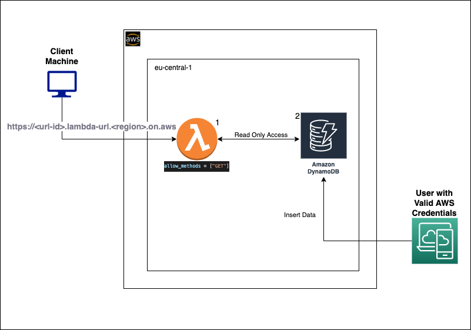
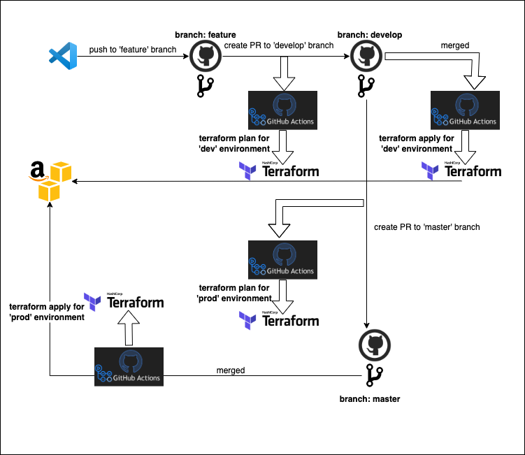
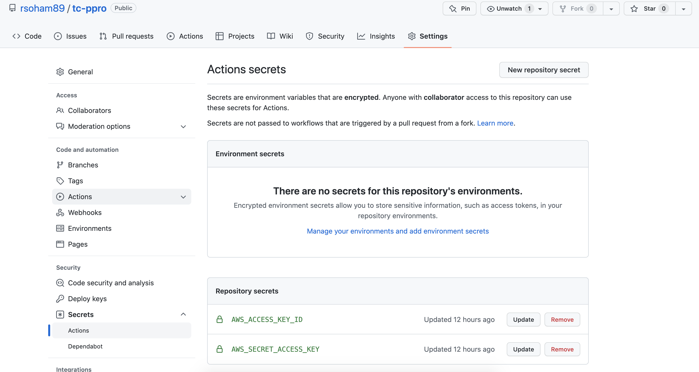
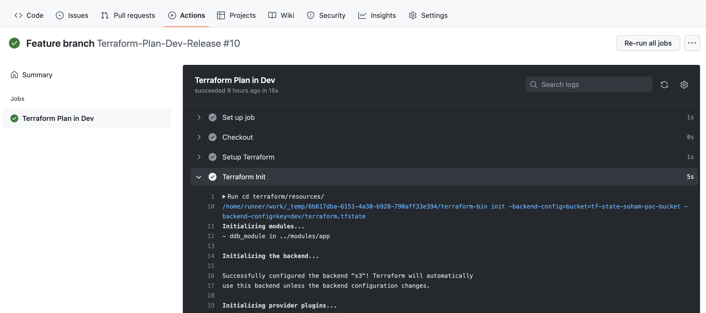
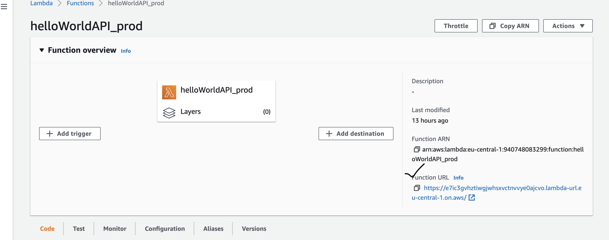
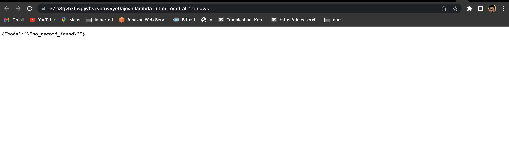
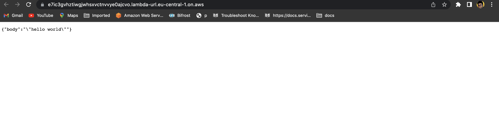

# Application Solution - Devops Engineering Challenge - Soham Roy 

### Requirement Gathering and Analysis

Create a minimalistic application designed to run on AWS, which upon receiving a HTTP GET /
request will connect to a database, fetch a “Hello World” string from it and return it as a reply to
the requester. This application needs to support two distinct infrastructure environments: dev and
prod.

For code reusability [**Terraform**](https://www.terraform.io) has been chosen as IaC. The runtime environment chosen is Python 3.8.


### Tech Stack and Installation Guide

For the MVP the below tools are selected

**AWS CLI** | v1.2 | [Click here to install](https://docs.aws.amazon.com/cli/latest/userguide/install-cliv2-mac.html)

**Terraform** | >v0.13 | [Click here to install](https://learn.hashicorp.com/tutorials/terraform/install-cli)

**Terraform-docs** | 0.16 | `brew install teraaform-docs`

**Python** | v3.8 | [Click here to install](https://www.python.org/downloads/release/python-3811/)

**Boto3** | N/A | ```pip install boto3 / pip3 install boto3```


## Application Architecture 

Before diving into the application architecture diagram lets first break down the requirement.
- A HTTP GET request will be sent to an API. So, the request is ad hoc. This indicates that a serverless framework is suited for the application layer, hence **lambda**.
- This is a minimalistic application. Hence it is safer to conclude a 'cost optimized' framework. The databased asked was a managed database. So, if we follow the serverless model we can either go for *Aurora Serverless* or *Dynamodb*. I chose **Dynamodb** in **On_Demand** mode as we don't need any structured data and we don't need any provisioned RCU and WCU. 

### What I excluded

- VPC : No VPC, as this is mostly required to connect to Dynamodb via Endpoint Gateway. This would have *increased the cost*.
- API GateWay: As there is no requirement to scale or enhance the APIs, I didn't find any immediate necessity to use an API G/W. Lambda Urls are introduced in April 2022 for directly exposing the lambda over the internet. This fits in here.
- Route 53 record: Not needed immediately. Hosted zones are charged. But there is a provision to add alias records.
- Using another DynamoDB for the terraform state lock to avoid parallel executions of terraform apply. This can be added later as enhancement. **This is handled in github to run only one execution at a time**.

So now please refer to the  architecture diagram



### Detailed analysis:

**1. Application Layer ( Lambda, Lambda Role, Lambda Function Url ) :** 

Lambda is deployed in the region eu-central-1. In order to follow the **least priviledge** principle, the lambda execution role contains these basic policies-
   - sts assume role
   - cloudwatch ( not in IaC, added as default when lambda is created). On hitting the first request in Lambda, the cloudwatch log group is created.
   - dynamodb readonly access - To read from the dynamodb.

I chose Python 3.8 as the native runtime as most of the dependent libraries are already there. The handler function is getting a call, connecting to the database and **GetItem** is used to fetch the record from the database.
The database name is passed as `ENVIRONMENT VARIABLE`.

The Lambda function url used is with AUTH_TYPE `NONE`. This by default comes in the form of `https` so the connection is secured.

**2. Database Layer (Dynamodb ) :** As mentioned before Dynamodb suits the best here as it is there in the AWS free tier, goes well with serverless architectures and has `On Demand` provisioning. 
As the requirement doesn't speak about the data much, I have **not opted** to use a `Sort Key`. The table only contains the `Partition Key: Statement` and one such item under the *statement* key is *hello world*.


## Infrastructure as code

The terraform code has 4 main sections -

1. Backend: This has the code for the creation of the backend S3. The script can be found in `scripts/init.sh`. This needs to be executed from local build.
2. Modules: The modules/app/ directory is the placeholder for the setup of the application as well as the database layer. 
3. Resources: This is the placeholder where we run the terraform init, plan and apply.
4. Environments: The placeholder where we have different *tfvars* of different environments. Different stages refer to different tfvars.

The following are the breakdown of all the terraform objects (generated from terraform-docs):

### Providers

| Name | Version |
|------|---------|
| <a name="provider_archive"></a> [archive](#provider\_archive) | n/a |
| <a name="provider_aws"></a> [aws](#provider\_aws) | n/a |

### Modules

| Name | Source | Version |
|------|--------|---------|
| <a name="module_ddb_module"></a> [ddb\_module](#module\_ddb\_module) | ../modules/app/ | n/a |


### Resources

| Name | Type |
|------|------|
| [aws_dynamodb_table.basic-dynamodb-table](https://registry.terraform.io/providers/hashicorp/aws/latest/docs/resources/dynamodb_table) | resource |
| [aws_iam_role.lambda_ddb_role](https://registry.terraform.io/providers/hashicorp/aws/latest/docs/resources/iam_role) | resource |
| [aws_iam_role_policy_attachment.dynamodb_access_policy](https://registry.terraform.io/providers/hashicorp/aws/latest/docs/resources/iam_role_policy_attachment) | resource |
| [aws_lambda_function.lambda_api](https://registry.terraform.io/providers/hashicorp/aws/latest/docs/resources/lambda_function) | resource |
| [aws_lambda_function_url.url](https://registry.terraform.io/providers/hashicorp/aws/latest/docs/resources/lambda_function_url) | resource |
| [archive_file.zipped_file](https://registry.terraform.io/providers/hashicorp/archive/latest/docs/data-sources/file) | data source |

### Inputs

| Name | Description | Type | Default | Required |
|------|-------------|------|---------|:--------:|
| <a name="input_dynamo_table_billing_mode"></a> [dynamo\_table\_billing\_mode](#input\_dynamo\_table\_billing\_mode) | Provisioned or Pay Per Request | `string` | `"PAY_PER_REQUEST"` | no |
| <a name="input_dynamo_table_hash_key"></a> [dynamo\_table\_hash\_key](#input\_dynamo\_table\_hash\_key) | The partition key of the table (In this case the primary key) | `string` | `"Statement"` | no |
| <a name="input_dynamo_table_name"></a> [dynamo\_table\_name](#input\_dynamo\_table\_name) | The main database from where the data will be retrieved | `string` | `"Statements"` | no |
| <a name="input_env"></a> [env](#input\_env) | Environment dev or prod | `string` | `"dev/prod"` | no |
| <a name="input_lambda_function_name"></a> [lambda\_function\_name](#input\_lambda\_function\_name) | Name of the lambda function | `string` | `"helloWorldAPI"` | no |
| <a name="input_lambda_handler"></a> [lambda\_handler](#input\_lambda\_handler) | Name of the handler function | `string` | `"lambda_function.lambda_handler"` | no |
| <a name="input_lambda_role_ddb_name"></a> [lambda\_role\_ddb\_name](#input\_lambda\_role\_ddb\_name) | Lambda execution role | `string` | `"lambda-exec-role"` | no |
| <a name="input_lambda_runtime"></a> [lambda\_runtime](#input\_lambda\_runtime) | Lambda runtime environment | `string` | `"python3.8"` | no |

### Outputs

| Name | Description |
|------|-------------|
| <a name="output_lambda_url"></a> [lambda\_url](#output\_lambda\_url) | n/a |

## Local Deployment Guide

You need to ensure that the above mentioned tools are installed successfully. The best way is to check for the versions of the tool.

```bash

# for terraform version
terraform version
# for aws-cli version
aws --version
# for terraform-docs version
terraform-docs version

```

Next step is to ensure that you have configured your aws profile so that can run terraform

```bash

# aws configure
  <provide your access id>
  <provide your secret id>
  <provide your region ( eu-central-1)>
  <provide default type as json>
```

Download the code from github: 
```bash
git clone https://github.com/rsoham89/tc-ppro.git
```

```bash

cd tc-ppro/scripts

# To create the backend run the init.sh

bash init.sh

```

The *init.sh* script first creates the backend s3 bucket and then stores the tfstate file locally. The code for the infrastructure has been modularized and can be used for various environments. As of now only the stage = dev and prod are deployed.

This will take hardly 1-2 minutes of time. Once the terraform completes creating the infrastructure we can run *terraform state list* to list all the aws objects just created via terraform.

```
cd ../terraform/backend/
terraform state list

aws_s3_bucket.state_storage
aws_s3_bucket_acl.state_storage_acl
```

## CI/CD Pipeline

Again coming back to the cost-optimized option, I opted for `github actions` as a bare minimum setup is required for the same. 

Github actions can be used to create infrastructure based on the status of the git branches. The below diagram explains the CI/CD in a nutshell.



The code for github actions is in the `.github/workflows` directory. From the github end we need to add the access key and the secret key added in the github action secrets.



Once that is added git action knows on which account to deploy on aws.

Lets have a small discussion of the workflows -

- **Step 1: Local code build and push to feature branch**

  This triggers the git action to create a `terraform plan` for the **dev** environment. Please note the backend is configured in `terraform init -backend-config=bucket=tf-state-soham-poc-bucket -backend-config=key=dev/terraform.tfstate` in the CI/CD task -

  

  Then it performs a terraform plan - 
  `terraform plan --var-file=../environments/dev/dev.tfvars -no-color`

  The merge request will not turn green till the workflow runs successfully. Once the workflow is a success, the reviewer can review the code and merge to `develop` branch.

- **Step 2: Merged to Develop**

  This triggers the git action to create a `terraform apply` for the **dev** environment. Please note the backend is configured in `terraform init -backend-config=bucket=tf-state-soham-poc-bucket -backend-config=key=dev/terraform.tfstate` in the CI/CD task.

  Then it performs the terraform apply and creates the environment in aws - 
  `terraform apply --var-file=../environments/dev/dev.tfvars -no-color`

 So now we have the setup ready in the dev account and necessary testing is done, we can proceed to deploy in production which leads us to the 3rd Step.

- **Step 3:Create a PR to master**

  This triggers the git action to create a `terraform plan` for the **prod** environment. Please note the backend is configured in `terraform init -backend-config=bucket=tf-state-soham-poc-bucket -backend-config=key=prod/terraform.tfstate` in the CI/CD task -


  Then it performs a terraform plan - 
  `terraform plan --var-file=../environments/prod/prod.tfvars -no-color`

  The merge request will not turn green till the workflow runs successfully. Once the workflow is a success, the reviewer can review the code and merge to `master` branch.

  and finally

 - **Step 4: Merged to Master**

  This triggers the git action to create a `terraform apply` for the **prod** environment. Please note the backend is configured in `terraform init -backend-config=bucket=tf-state-soham-poc-bucket -backend-config=key=prod/terraform.tfstate` in the CI/CD task.

  Then it performs the terraform apply and creates the environment in aws - 
  `terraform apply --var-file=../environments/prod/prod.tfvars -no-color`

## Data Management

Now since the lambdas are up we will be able to get the url from the AWS console and have a look.



But if we click on this url it will show us `No Records Found`. This is because there is no record in the dynamodb database and it went to the except block.

```
import json
import boto3 
import os

dynamodb = boto3.client('dynamodb')

def lambda_handler(event, context):
    
    try:
        data = dynamodb.get_item(TableName=os.environ["db_name"], Key={'Statement':{'S':'hello world'}})["Item"]["Statement"]["S"]
    except:
        data = 'No record found'
    return {
        'body': json.dumps(data)
    }
```
PFA the screenshot:



### Adding the data

For adding the sample data, for simplicity I have provided two scripts in the **scripts** directory
- insert_data_dev.py
- insert_data_prod.py

This script uses boto3 to Put Item in the dynamodb database. Here is a snippet -
```
  dynamodb = boto3.client('dynamodb')
  item = {
	'Statement': {
		'S': 'hello world'
		}
  }
  try:
    dynamodb.put_item(TableName='Statements_prod', Item=item)
    print('Item Added Successfully')
  except Exception as e:
    print(e)

main()
```

So if you run `python3 scripts/insert_data_prod.py` that will add the data in the dynamodb in prod, and will show *Item Added Successfully*.

Now if we refresh the lambda url, we will see the data.



## Destroy the infrastructure ( Local Build)

I have automated this part as well. You need to go to scripts and run `bash destroy.sh`
This script first destroys the dev environment, then the prod environment and finally the backend config.

```
## Create backend for tfstate
echo "Destroy infrastructure"
cd ../terraform/resource/
## Destroy the dev profile
terraform init -backend-config=bucket=tf-state-soham-poc-bucket -backend-config=key=dev/terraform.tfstate
#Not using auto-approve
terraform destroy  --var-file=../environments/dev/dev.tfvars
## Destroy the dev profile
terraform init -backend-config=bucket=tf-state-soham-poc-bucket -backend-config=key=prod/terraform.tfstate -reconfigure
#Not using auto-approve
terraform destroy  --var-file=../environments/prod/prod.tfvars
##Destroy the backend
cd ../backend/
terraform destroy
```

Thank you for reading the README. If you have any further queries please reach out to me via email.


